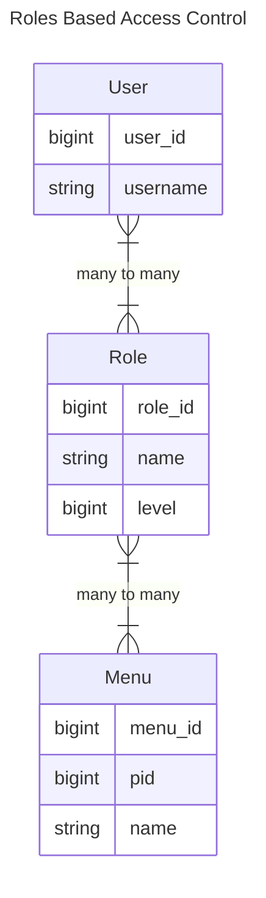

## 基于ASP.NET Core 搭建后台管理系统

数据模型

```mermaid
---
title: Roles Based Access Control
---
erDiagram
    User {
        bigint user_id
        string username
    }
    Role {
        bigint role_id
        string name
        bigint level
    }
    Menu {
        bigint menu_id
        bigint pid
        string name
    }
    
    User }|--|{ Role: "many to many"
    Role }|--|{ Menu: "many to many"
```
