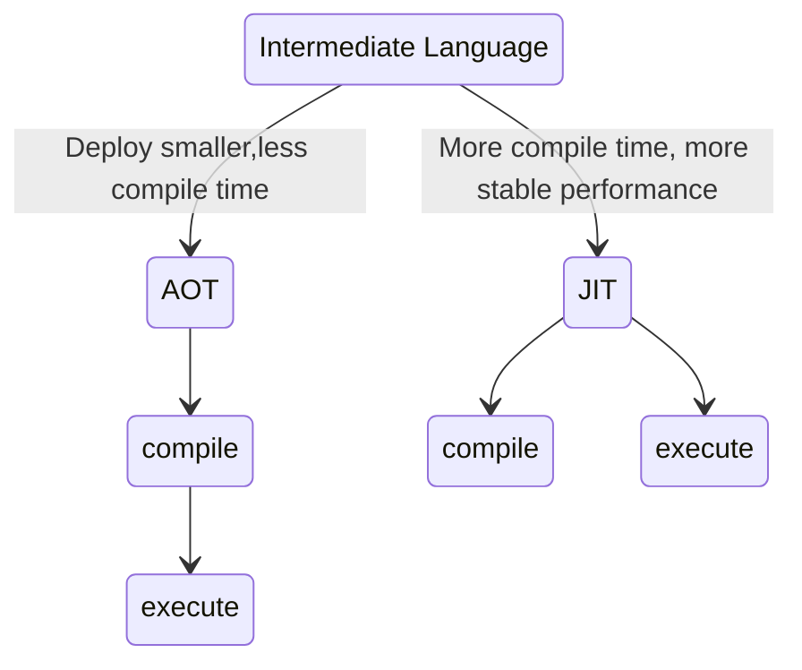

# 什么是 .NET?

.NET 是用于应用程序开发的[生态系统](#ecosystem), 它免费、开放源代码、跨平台，可生成多种类型的[应用程序](#application)。
本质上是名为**公共语言运行时 (Common Language Runtime CLR) 的虚执行系统和一组类库**.有关.NET的详细信息,参阅[.NET体系结构](../architecture.md).

## 构成

- [.NET SDK](../component/sdk.md) - 用于开发、生成和测试应用的一组工具、库和运行时。
- [.NET 运行时](../component/sdk.md) - 用于运行应用的一组运行时和库。

**SDK与运行时是包含关系,如下图**

## .NET语言

运行时支持多种编程语言.如C#、F# 和 Visual Basic 语言.

- C# 是一种简单、现代、面向对象和类型安全的编程语言。 它源于 C 语言系列，C、C++、Java 和 JavaScript 程序员很快就可以上手使用。

- F# 是一种可互操作的编程语言，用于编写简洁、可靠的高性能代码。 F# 编程是面向数据的，其中代码涉及到用函数转换数据。

- Visual Basic 使用更详细语法，更接近普通人类语言。

## 开发环境

开发环境的搭建取决于喜欢可视化的工作流(也叫做IDE,集成开发环境)还是Shell.

### 集成开发环境

- [Visual Studio](https://visualstudio.microsoft.com/zh-hans/?utm_source=developermscom)
- [Rider](https://www.jetbrains.com/zh-cn/rider/)

### Shell

- Visual Studio Code 和 .NET SDK
- Other..

## 编译

.NET 应用被编译为中间语言 (Intermediate Language IL)。 IL 是一种紧凑的代码格式，可在任何操作系统或体系结构上受到支持。 大多数 .NET 应用使用在多种环境下支持的 API，只需运行 .NET 运行时。

.NET 支持提前 (AOT) 和实时 (JIT) 编译模型。

**AOT与JIT编译的区别如下**

## 部署模型

可以在两种不同模式下发布 .NET 应用：

- 独立应用,生成的应用程序将包含 .NET 运行时和库，以及该应用程序及其依赖项。 应用程序的用户可以在未安装 .NET 运行时的计算机上运行该应用程序。

- 依赖于框架的应用,是属于跨平台的,且应用不包含.NET运行时,因此要求用户安装.NET运行时.
  并且会生成dll文件形式的一个跨平台二进制文件和面向当前平台的可执行文件.

**两种方式的构成如下图**

**如何选择部署方式?**

| 部署方式   | .NET 版本                           | 平台   | 体积                                |
| ---------- | ----------------------------------- | ------ | ----------------------------------- |
| 独立       | 可控制随应用部署的.NET 版本         | 特定平台 | 大型, 包含应用及其依赖和.NET 运行时 |
| 依赖于框架 | 需预先安装.NET 运行时, 所有应用共享 | 跨平台 | 小型, 仅包含应用及其依赖            |

## 生态系统

.NET 有多个实现，每个实现都支持不同类型的应用.有关实现的详细信息,参阅[.NET实现](implements.md).

.NET 实现（历史顺序）：

- .NET Framework - 它提供对 Windows 和 Windows Server 的广泛功能的访问权限。 此外，它还广泛用于基于 Windows 的云计算。 是原始 .NET。
- Mono - 一个跨平台 .NET Framework 实现。 原始社区和开放源代码 .NET。 用于 Android、iOS 和 Wasm 应用。
- .NET (Core) - .NET 的一个跨平台开放源代码实现，已针对云时代进行了反思，同时与 .NET Framework 保持极大的兼容。 用于 Linux、macOS 和 Windows 应用。

## 应用

**云应用**

- 云原生应用
  ~~- 控制台应用
- 云中的无服务器函数
- Web 应用、Web API 和微服务

**跨平台客户端应用**

- 桌面应用
- 游戏
- 移动应用

**Windows 应用**

- Windows 桌面应用
- Windows 窗体
- Windows WPF
- 通用 Windows 平台 (UWP)
- Windows 服务~~

开发环境
